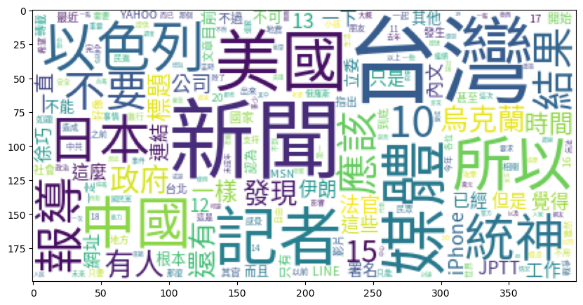

## Code
#### [Task 1 code](https://github.com/kevin000001505/PPT_Scraping/blob/main/ppt_scrapy/ppt_scrapy/spiders/scrapy_doc.py)
#### [Task 2 code](https://github.com/kevin000001505/PPT_Scraping/blob/main/ppt_scrapy/ppt_scrapy/spiders/scrapy_doc2.py)

## Data
#### [Task 1 json file](https://github.com/kevin000001505/PPT_Scraping/blob/main/ppt_scrapy/task1_results.json)
#### [Task 2 json file](https://github.com/kevin000001505/PPT_Scraping/tree/main/ppt_scrapy/data)
#### In Task 2 file: 
Because the file is too many, so I turn all the JSON file into zip

#### I also use NLP to turn the context into wordcloud to see these sevenday what kins of word been mention most

